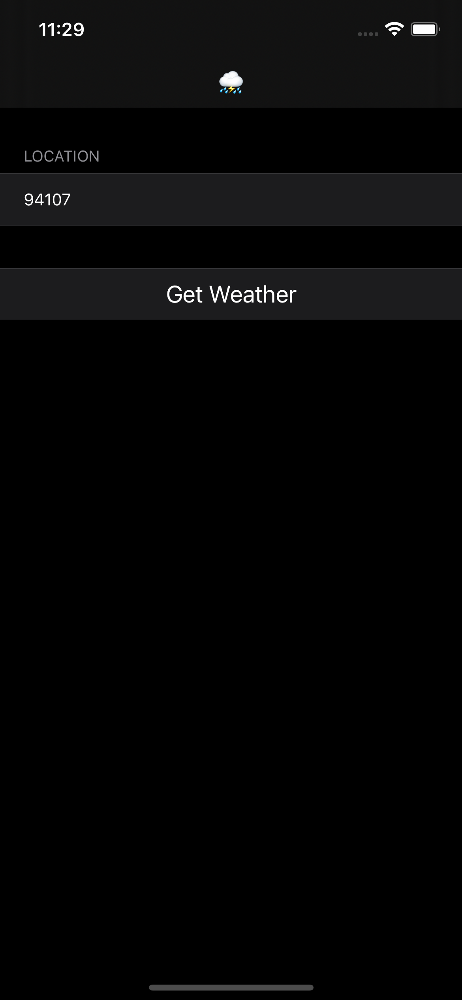
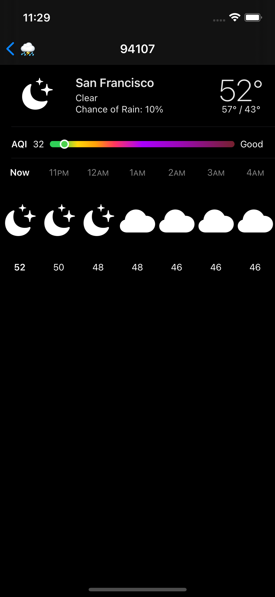

# WAWeatherPlatter

This app links to `/System/Library/PrivateFrameworks/Weather.framework` and pushes the `WAWeatherPlatterViewController`. This view appears inside the Apple Maps app when you long-press on the weather in the corner of the map.

## Screenshots

~ | ~ 
--|--
 | 

